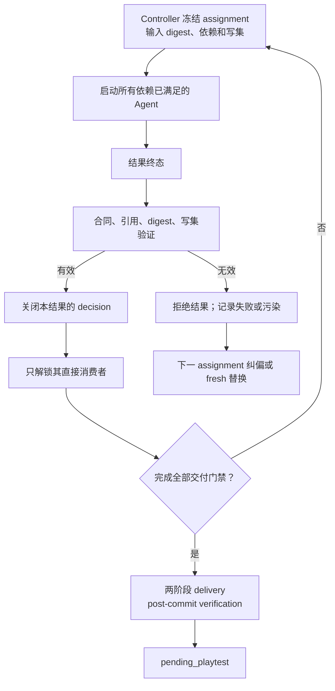
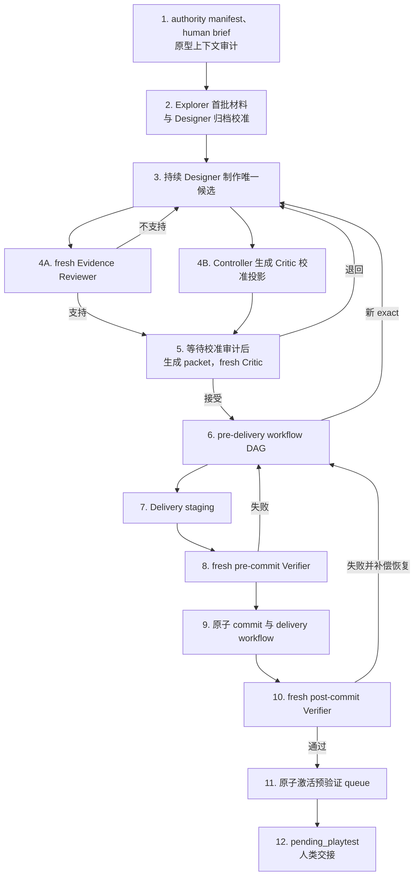

# 单主 Agent 依赖屏障式关卡设计流程

```yaml
workflow_id: single-controller-level-design
workflow_version: 2.0.0
entrypoint: docs/single-controller-level-design/README.md
scope: specific_prototype_single_level
```

本文是本流程的唯一入口。执行者先完整读取本文，再按阶段读取同目录分册；不得把分册单独当作主流程。

本流程围绕一个人类体验种子，为一个特定类推箱子原型制作、审查并交付一个唯一单关候选。它不实现原型、不修改通用 runtime、不并行设计多个候选，也不覆盖多关课程设计。

设计本体以 [玩家体验核心与单关包装方法论](../17-experience-core-level-design.md) 为准；角色权威和正向流程以 [关卡设计工作室执行标准](../21-level-design-studio-standard.md) 与 `$sokoban-level-design-studio` 为准。本目录只规定单一 Controller、依赖屏障、文件交付和事务化 delivery，不取代专业合同。

## 独立工作区

全部中间产物统一写入：

```text
reports/single-controller-level-design/<prototype-id>/<task-id>/
```

开始前必须用 `git check-ignore` 确认该目录被忽略。不得把中间产物写入旧 Studio reports、原型 `studio/` 或其它可跟踪路径；不得使用 `git add -f`。

只有通过全部门禁的最终关卡和 authority 明确要求的相关数据可以写出工作区。目标逐项来自当前原型 `docs/design_handoff.yml` 与 required authority docs；示例路径不构成授权。

## 唯一 Controller

整个任务只有一个主 Agent：**轮次控制器**。它可以：

- 初始化任务、authority manifest、human brief、单候选账本和版本槽位；
- 创建 assignment、冻结输入 digest 和写集；
- 启动、恢复、纠偏或替换子 Agent；
- 验证结果信封、专业 artifact、引用、digest 和状态前置条件；
- 记录 decision，解锁依赖已经满足的下一波工作；
- 组装 Critic 白名单 packet；
- 编排提交前 workflow、两阶段 delivery 和人类交接。

Controller 不设计 layout、不补跑专业证据、不代写独立 review、不覆盖 Critic verdict，也不替人类决定作品去留。

所有子 Agent：

```yaml
subagent_spawn_allowed: false
```

需要扩展工作时，子 Agent 只能交付局部 request、缺失输入或阻塞；由 Controller 另行调度。

## 依赖屏障

轮次是共享冻结状态与写集的小型事务组，不是全任务唯一并发单位。



一个结果收口后，只要直接依赖已经验证，消费者即可在新轮次启动；不必等待无依赖的慢任务。以下工作必须串行：

- 消费同一未关闭 decision；
- 读写同一候选控制状态；
- 修改或审查同一 exact；
- 写入路径相交；
- Critic 等待硬证据 `supported`；
- delivery 的 stage、pre-commit verify、commit、post-commit verify。

聊天、Agent 最终消息和 Controller 记忆都不是权威状态。权威状态只来自版本化文件、内容 digest 和关闭的 decision。

## 硬性不变量

1. 一个任务只有一个 `candidate_id`、至多一个当前 exact 和至多一个 delivery version。
2. Designer 与 task-local Explorer 持续复用；每个 exact 的 Evidence Reviewer 和 Critic 必须 fresh。
3. 同一 exact 只使用一名 Critic，不投票、不补第二意见。
4. 子 Agent 只读 assignment 白名单文件，只写授权写集。
5. 每个输入文件必须带调度时 SHA-256；消费前重新校验。
6. 结果必须进入合法终态并通过合同验证，才能写采用 decision。
7. 消费某结果的 assignment 必须引用关闭的 decision；无依赖活动不互相阻塞。
8. 有效并行结果不因同组其它结果失败而重跑。
9. 越权、版本错配或污染产物不进入权威状态；一次新 assignment 纠偏后仍失败则更换 fresh Agent。
10. 任何语义性 exact 变化返回持续 Designer，并重新发布完整送审快照。
11. Delivery Operator、pre-commit Verifier、post-commit Verifier 实例互不相同。
12. post-commit verification 通过后才可原子激活预验证的 queue 计划；激活前账本和 queue 都不得登记 `pending_playtest`。
13. 只有人类试玩可以填写最终去留状态。

## 固定阶段



具体调度见 [调度协议](orchestration-protocol.md)，角色防火墙见 [Agent 合同](agent-contracts.md)，文件、digest 与编号见 [文件与版本协议](artifact-versioning.md)。

## 直接复用

- [`sokoban-level-designer`](../../.agents/skills/sokoban-level-designer/SKILL.md)
- [`sokoban-mechanism-lab`](../../.agents/skills/sokoban-mechanism-lab/SKILL.md)
- [`sokoban-evidence-reviewer`](../../.agents/skills/sokoban-evidence-reviewer/SKILL.md)
- [`sokoban-puzzle-critic`](../../.agents/skills/sokoban-puzzle-critic/SKILL.md)
- [`level-design-controller.mjs`](../../.agents/skills/sokoban-level-design-studio/scripts/level-design-controller.mjs)

上下文审计员、Workflow Worker、Delivery Operator 和两个 Delivery Verifier 是 assignment 定义的临时角色，不是新 skill。

## 完成条件

```text
submission_packet = complete
solution_uniqueness_review = supported
independent_hard_evidence = supported
critic_verdict = worth_playtesting
pre_delivery_checks = completed_or_recorded_not_applicable
workflow_record = aggregate_and_valid
delivery_version_evidence = current
pre_commit_delivery_verification = supported
post_commit_delivery_verification = supported
queue_activation = exact_preverified_plan
playtest_status = pending_playtest
```

完成只表示“值得交给人类试玩”，不表示已经进入正式归档。
