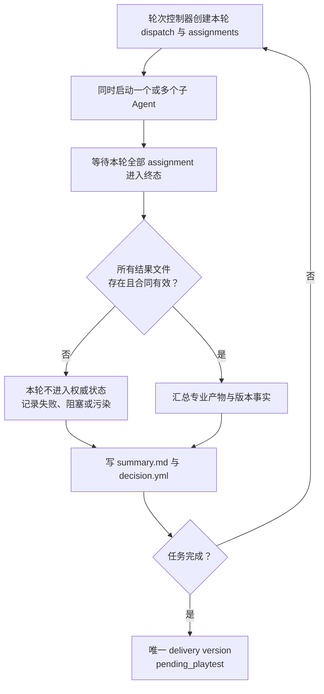
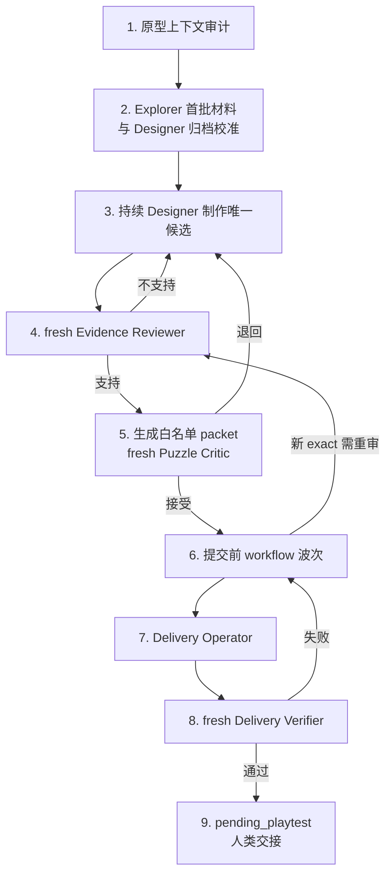

# 单主 Agent 屏障式关卡设计流程

```yaml
workflow_id: single-controller-level-design
workflow_version: 1.0.0
entrypoint: docs/single-controller-level-design/README.md
scope: specific_prototype_single_level
```

本文是本流程的唯一主入口。执行者必须先完整读取本文，再按本文的阶段路由读取同目录分册；不得绕过本文直接把某一分册当作流程入口。

本流程围绕一个人类体验种子，为一个特定类推箱子原型制作、审查并交付一个唯一单关候选。它不实现原型，不修改通用 runtime，不同时设计多个候选，也不覆盖多关课程设计或仓库通用多 Agent 编排。

设计本体仍以 [玩家体验核心与单关包装方法论](../17-experience-core-level-design.md) 为准，专业角色的原始职责仍以 [关卡设计工作室执行标准](../21-level-design-studio-standard.md) 和对应 skill 为准。本目录只重新规定单一入口、轮次屏障、文件交付和版本化编排，不取代专业合同。

## 独立工作区

本流程的全部中间文档、assignment、Agent 结果、exact 快照、review 和交付审计统一写入：

```text
reports/single-controller-level-design/<prototype-id>/<task-id>/
```

该仓库根目录 `reports/` 已由现有 `.gitignore` 忽略。新流程不得把中间产物写入旧 Studio 使用的 `prototypes/<prototype-id>/reports/`，也不得写入原型的 `studio/` 目录，从而避免与原 skill 的任务目录、账本和版本文件冲突。禁止使用 `git add -f` 添加本工作区。

只有通过全部门禁的最终关卡和原型规定的相关数据可以写出工作区；具体目标继续由当前原型 `docs/design_handoff.yml` 和 authority docs 决定，通常是：

```text
prototypes/<prototype-id>/studio/levels.yml
prototypes/<prototype-id>/levels.yml
prototypes/<prototype-id>/playable_queue.yml
原型规定的 playable 数据或构建产物
```

流程文档不自行选择其中哪个目标，也不改变原型既有文件格式。

## 唯一主 Agent

整个任务只有一个主 Agent，角色名为 **轮次控制器**。只有轮次控制器可以：

- 初始化任务目录、任务清单和单候选控制状态；
- 为当前轮次创建 assignment；
- 启动、恢复或替换子 Agent；
- 等待当前轮次所有 assignment 进入终态；
- 从结果文件汇总事实并写出本轮决策；
- 调用确定性控制脚本校验 assignment、账本或 Critic packet；
- 根据已获授权的专业结论记录状态并创建下一轮；
- 编排提交前 workflow、唯一待玩交付和人类交接。

轮次控制器不得亲自设计布局、补跑专业证据、代写独立审查、覆盖 Critic 结论或代替人类决定作品去留。子 Agent 一律设置：

```yaml
subagent_spawn_allowed: false
```

子 Agent 不得再创建、委派或管理其它 Agent。需要扩展工作时，它只能在结果文件中声明新的材料需求或阻塞项，由轮次控制器在下一轮调度。

## 主循环



每轮可以只有一个 assignment，也可以包含多个互不依赖的 assignment。无论数量多少，下一轮都不得在当前轮全部收口前启动。聊天回复、Agent 最终消息或主 Agent 的记忆都不是权威交付；只有 assignment 指定位置中的版本化文件可以进入汇总和决策。

## 硬性不变量

1. 一个任务只有一个 `candidate_id`、至多一个当前已发布 `exact_version` 和至多一个 `delivery_version`。
2. Designer 与 task-local Explorer 在任务内持续复用；每个 exact 的 Evidence Reviewer 和 Puzzle Critic 必须 fresh。
3. 同一 exact 只使用一名 Puzzle Critic，不投票、不讨论、不补第二意见。
4. 子 Agent 只能读取 assignment 白名单输入，只能写 `allowed_output_refs`。
5. 当前轮全部结果达到 `completed`、`failed`、`blocked` 或 `needs_input` 后，轮次控制器才能写 `decision.yml`。
6. `decision.yml` 写入并通过引用检查之前，不得创建下一轮 dispatch。
7. 失败项只在下一轮重试；已经有效的同轮结果不因同伴失败而重跑。
8. 越权、版本错配或信息污染的产物不进入权威状态；纠偏失败后必须更换 fresh Agent。
9. 提交前操作改变 exact 时，除非原型 authority 明确允许保留 review 且所有复验条件均满足，否则形成新 exact 并重跑硬证据和 Critic。
10. Delivery Operator 与 Delivery Verifier 必须是不同实例；只有人类试玩可以填写最终去留状态。
11. 所有中间产物只能位于根目录 `reports/single-controller-level-design/`；Git 变更只能来自获准写出的最终关卡及原型相关数据。

## 固定阶段



具体屏障、失败和状态转换见 [调度协议](orchestration-protocol.md)。角色输入、输出、复用和防火墙见 [Agent 合同](agent-contracts.md)。任务目录、结果信封和编号规则见 [文件与版本协议](artifact-versioning.md)。

## 直接复用

本流程不修改以下现有实现：

- [`sokoban-level-designer`](../../.agents/skills/sokoban-level-designer/SKILL.md)
- [`sokoban-mechanism-lab`](../../.agents/skills/sokoban-mechanism-lab/SKILL.md)
- [`sokoban-evidence-reviewer`](../../.agents/skills/sokoban-evidence-reviewer/SKILL.md)
- [`sokoban-puzzle-critic`](../../.agents/skills/sokoban-puzzle-critic/SKILL.md)
- [`level-design-controller.mjs`](../../.agents/skills/sokoban-level-design-studio/scripts/level-design-controller.mjs)

新增的原型上下文审计员、Workflow Worker、Delivery Operator 和 Delivery Verifier 只是本流程文档定义的临时角色，不是新 skill。

## 完成条件

只有同时满足以下条件，轮次控制器才可把任务设为 `ready_for_playtest`：

```text
submission_packet = complete
solution_uniqueness_review = supported
independent_hard_evidence = supported
critic_verdict = worth_playtesting
pre_submission_checks = completed_or_recorded_not_applicable
delivery_version_evidence = current
delivery_verification = supported
playtest_status = pending_playtest
```

完成表示“值得交给人类试玩”，不表示作品已经被接受进入正式归档。
